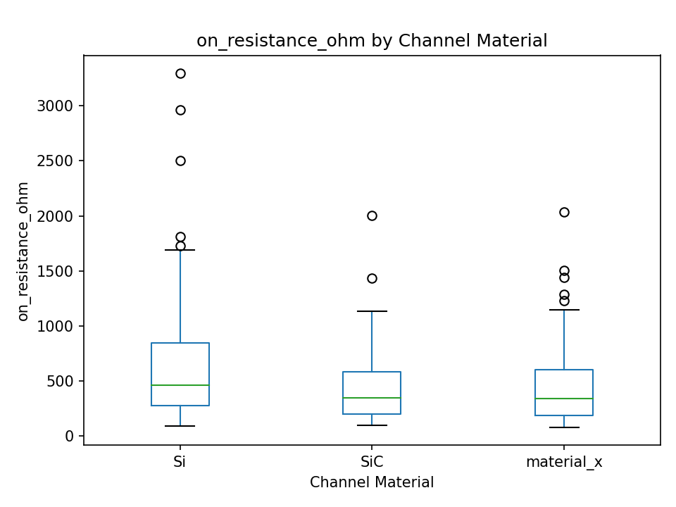
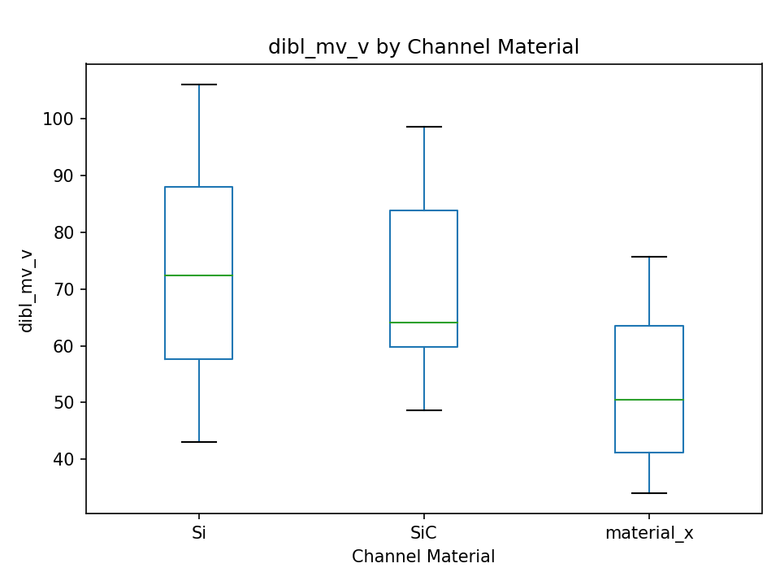

# Graduate Assist

Graduate Assist is a LangGraph-based agentic workflow for graduate-level experimental data analysis.
It turns a dataset and study description into structured artifacts, statistical results, and
publication-style reporting, with an optional reviewer rebuttal loop and a literature context check.

## Features

- Agentic pipeline with discrete nodes for context, data QA, planning, execution, reporting, rebuttal,
  and web-context assessment.
- Artifacts-first outputs in JSON, YAML, and Markdown for reproducibility.
- Rule-based analysis selection with optional LLM-written prose.
- Reviewer feedback handling with conditional reanalysis or interpretation updates.

## Architecture

The LangGraph `StateGraph` wires the following nodes:

- ContextAgentNode: parse the experiment description into structured context.
- DataUnderstandingAgentNode: infer schema and data-quality issues.
- AnalysisPlanningAgentNode: select tests and assumptions.
- ExecutionAgentNode: run analysis and generate results/figures.
- ReportingAgentNode: write a conservative academic report.
- RebuttalAgentNode: draft a rebuttal and decide whether to reanalyze.
- WebContextAgentNode: query OpenAlex/Semantic Scholar and append a context note.

## Quick Start

```bash
python -m venv .venv
source .venv/bin/activate
pip install -r requirements.txt
```

```bash
PYTHONPATH=src python -m graduate_assist.run \
  --data examples/soil_npk_growth.csv \
  --description examples/experiment_description.md \
  --artifacts artifacts \
  --verbose
```

For more detailed walkthroughs, see `GETTING_STARTED.md`.

## Reviewer Flow

Trigger a rebuttal and conditional reroute with a reviewer comment:

```bash
PYTHONPATH=src python -m graduate_assist.run \
  --data examples/soil_npk_growth.csv \
  --description examples/experiment_description.md \
  --artifacts artifacts \
  --reviewer-comment "Please reanalyze the data; the current analysis appears incorrect."
```

You can also generate an automatic reviewer comment with `--auto-reviewer-comment` or override the
rebuttal strategy with `--rebuttal-strategy`.

## Outputs

Each run writes a unique folder under `artifacts/` containing:

- `context.json`
- `schema.yaml`
- `data_quality_report.md`
- `analysis_plan.yaml`
- `results.json`
- `figures/`
- `execution_log.txt`
- `report.md`
- `reviewer_comment.md` (when review comment exists)
- `rebuttal_decision.yaml` (when review comment exists)
- `rebuttal_response.md` (when review comment exists)
- `web_search_results.json`
- `web_context_comment.md`
- `langgraph.mmd`

## Optional LLM Configuration

If you want LLM-authored prose or LLM-assisted planning, set `LLM_PROVIDER` and `LLM_MODEL`.
The pipeline falls back to rule-based planning and templated text if the provider is unavailable.

OpenAI (gpt-4.1):
```bash
pip install openai
export LLM_PROVIDER=openai
export LLM_MODEL=gpt-4.1
export OPENAI_API_KEY=your_key_here
```

Ollama (local models):
```bash
export LLM_PROVIDER=ollama
export LLM_MODEL=llama3.1:8b
```

## Web Context Checks

The web-context node queries OpenAlex and Semantic Scholar. Network access is required; if searches
fail, the report will include a note describing the limitation.

## Example: Input to Output (Transistor Process Run)

Inputs used for `artifacts/run_20260110T075312Z_53f549c0`:

- Data: `examples/complex/transistor_process_data.csv`
- Description: `examples/complex/transistor_experiment_description.md`

Command:
```bash
PYTHONPATH=src python -m graduate_assist.run \
  --data examples/complex/transistor_process_data.csv \
  --description examples/complex/transistor_experiment_description.md \
  --artifacts artifacts
```

Selected output highlights (from `artifacts/run_20260110T075312Z_53f549c0/report.md`):

- Kruskal-Wallis test for on-resistance across channel materials: H=9.26, p=0.0098.
- Dunn post hoc: Si vs material_x p=0.0256 (Si vs SiC p=0.0964; SiC vs material_x p=1.0).
- Median improvements for material_x vs Si: Idsat +19.7%, gm +19.7%, mobility +37.6%,
  Ioff -32.1%, DIBL -30.2%, subthreshold swing -13.6%, Ron -27.0%.

Example figure (renders if the artifact exists in the repo):



